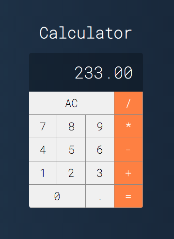
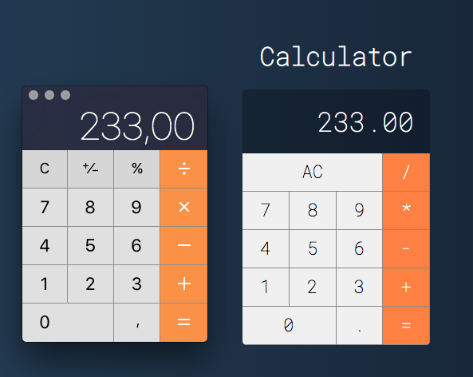

## To run is very simple.

1. First you need to clone of repository.

2. After this, you need to inside in the path of repository and run this command:

### `npm run start`

The project will run on the address http://localhost:3000

##### The React Calculator

##### The react calculator next to the MacOs calculator to compare the design

